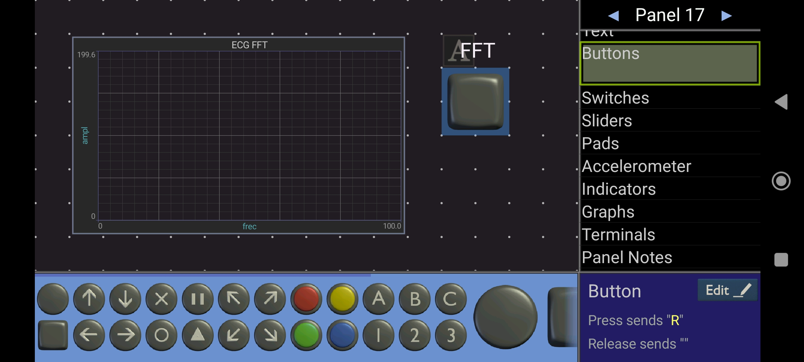
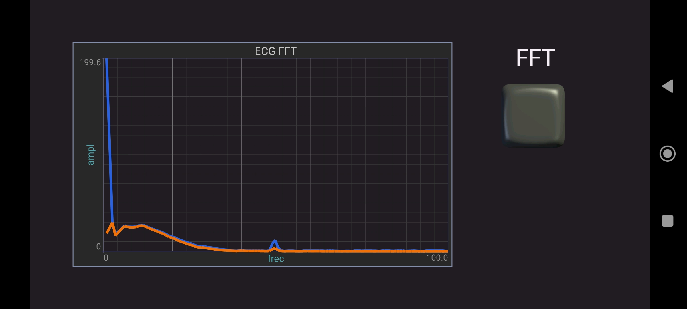

# Ejemplo Bluetooth - FFT

Este proyecto ejemplifica el uso del módulo de comunicación Bluetooth Low Energy (BLE), junto con el de cálculo de la FFT de una señal.
Permite graficar en una aplicación móvil la FFT de una señal.

## Cómo usar el ejemplo

### Hardware requerido

* ESP-EDU
* Dispositivo Android

### Configurar el proyecto

Para poder utilizar las funcionalidades de BLE en el ESP32, en primer lugar es necesario habilitar dicho módulo en el `sdkconfig`. Para ello puede copiar el `sdkconfig` de este proyecto (que ya se encuentra modificado) o modificar el propio:

1. Abrir `ESP-IDF: SDK Configuration Editor`: 
2. Buscar "Bluettoth" y habilitar la casilla `Bluetooth`
3. Buscar "4.2" y habilitar la casilla `Enable BLE 4.2 features`

Paso seguido debe modificar el `CMakeLists` de la carpeta `drivers`, descomentando la línea:

```cmake
#"microcontroller/src/ble_mcu.c"
```

Para utilizar las funcionalidades de DSP es necesario agregar la capa middelware al proyecto, modificando el archivo CMakeLists.txt (ubicado en la raiz del proyecto) con el siguiente contenido:

```cmake
cmake_minimum_required(VERSION 3.16)

list(APPEND EXTRA_COMPONENT_DIRS "../../drivers")
list(APPEND EXTRA_COMPONENT_DIRS "../../middelware")

include_directories(${PROJECT_NAME} ../../drivers)
include_directories(${PROJECT_NAME} ../../middelware)
include($ENV{IDF_PATH}/tools/cmake/project.cmake)
project(ej_dsp)
```

En este proyecto ya se han realizado estas modificaciones, por lo tanto no es necesaria ninguna acción extra para probarlo.

### Ejecutar la aplicación

1. Instalar y ejecutar en el dispositivo Android la aplicación [Bluetooth Electronics](https://play.google.com/store/apps/details?id=com.keuwl.arduinobluetooth)
2. Presionando en el botón `Connect`, vincular el móvil con la placa (se mostrará con el nombre `ESP_EDU_1`)
3. Crear un nuevo Panel que contenga un Gráfico "X-Y" (menú `Graphs`) y un botón (menú `Buttons`) que al presionarse envíe una "R".

4. Ejecutar este panel y presionar la el botón creado. Se graficará la magnitud del espectro de la señal de ECG (azul) y de la misma luego de ser filtrada (naranja).

