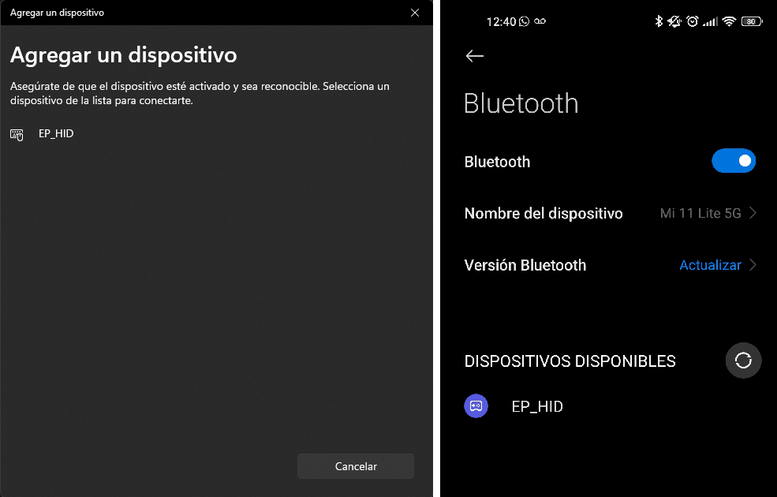

# Ejemplo Bluetooth Mouse-Teclado

Este proyecto ejemplifica el uso del Bluetooth Low Energy para simular un dispositivo HID. A partir de las señales generadas por el joystick analógico, emula un mouse (`desplazamiento del puntero` y `click izquierdo`). Además emula las teclas `barra espaciadora` y `flecha abajo` a partir de las teclas de la ESP-EDu (teclas `TECLA_1` y `TECLA_2` respectivamente).

## Cómo usar el ejemplo

### Hardware requerido

* ESP-EDU
* Joystick
* Computador o móvil con Bluetooth

|   Joystick    |   ESP-EDU     |
|:-------------:|:--------------|
|   GND         |   GND         |
|   +5V         |   3V3         |
|   VRX         |   CH0         |
|   VRY         |   CH1         |
|   SW          |   GPIO_23     |

### Configurar el proyecto

Para poder utilizar las funcionalidades de BLE en el ESP32, en primer lugar es necesario habilitar dicho módulo en el `sdkconfig`. Para ello puede copiar el `sdkconfig` de este proyecto (que ya se encuentra modificado) o modificar el propio:

1. Abrir `ESP-IDF: SDK Configuration Editor`: 
2. Buscar "Bluettoth" y habilitar la casilla `Bluetooth`
3. Buscar "4.2" y habilitar la casilla `Enable BLE 4.2 features`

Paso seguido debe modificar el `CMakeLists` de la carpeta `drivers`, descomentando la línea:

```cmake
#"microcontroller/src/ble_hid_mcu.c"
```

En este proyecto ya se han realizado estas modificaciones, por lo tanto no es necesaria ninguna acción extra para probarlo.

### Ejecutar la aplicación

1. Conectar el Joystick según las indicaciones anteriores.
2. Desde la PC o dispositivo móvil vincule el dispositivo bluetooth `EP_HID`.

3. Al mover el joystick observará el cursor del mouse moverse, y al presionar la `TECLA_1` y `TECLA_2` se enviaran los comandos del tecado correspondientes a las teclas `barra espaciadora` y `flecha abajo` respectivamente.
