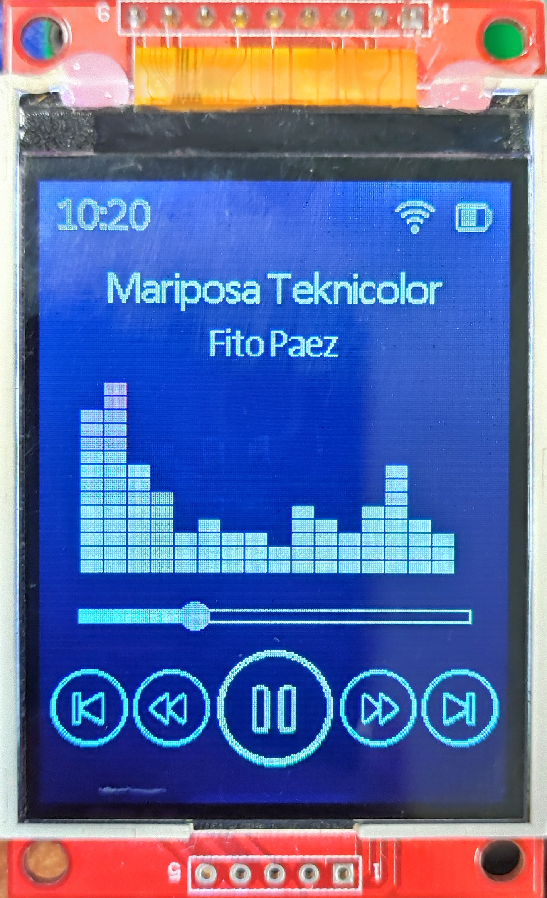

# Ejemplo Display LCD Color - Filtros

Este proyecto ejemplifica el del Conversor Digital Analógico `DAC` para la reproducción de audio, junto con el uso de la `pantalla LCD color` para graficar la interfaz de un reproductor de audio que incluye un vúmetro (graficado a partir del cálculo de la FFT de la señal).

## Cómo usar el ejemplo

### Hardware requerido

* ESP-EDU
* Display LCD color

#### Conexiones

 |      Display     |       ESP-EDU     |
 |:----------------:|:------------------|
 |      SDO/MISO    |       GPIO_22     |
 |      LED         |       3V3         |
 |      SCK         |       GPIO_20     |
 |      SDI/MOSI    |       GPIO_21     |
 |      DC/RS       |       GPIO_9      |
 |      RESET       |       GPIO_18     |
 |      CS          |       GPIO_19     |
 |      GND         |       GND         |
 |      VCC         |       3V3         |

### Configurar el proyecto

Para utilizar las funcionalidades de DSP es necesario agregar la capa middelware al proyecto, modificando el archivo CMakeLists.txt (ubicado en la raiz del proyecto) con el siguiente contenido:

```cmake
 cmake_minimum_required(VERSION 3.16)

list(APPEND EXTRA_COMPONENT_DIRS "../../drivers")
list(APPEND EXTRA_COMPONENT_DIRS "../../middelware")

include_directories(${PROJECT_NAME} ../../drivers)
include_directories(${PROJECT_NAME} ../../middelware)
include($ENV{IDF_PATH}/tools/cmake/project.cmake)
project(ej_dsp)
```

En este proyecto ya se han realizado estas modificaciones, por lo tanto no es necesaria ninguna acción extra para probarlo.

### Ejecutar la aplicación

1. Conectar la pantalla LCD según las indicaciones anteriores.
2. Conectar un parlante potenciado a la salida analógica, según las indicaciones anteriores.
3. Al correr el programa podrá observar la siguiente interfaz:

4. Al presionar la `TECLA_1` el audio comenzará a reproducirse.
